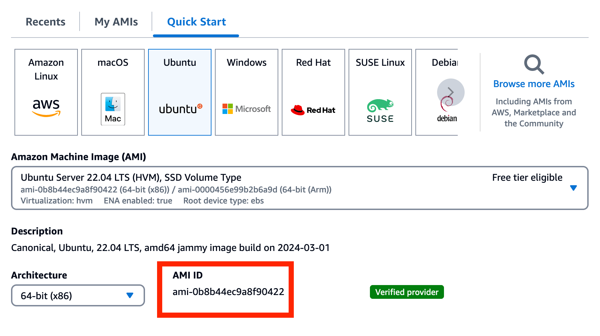
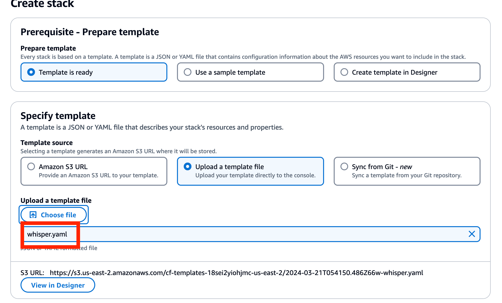
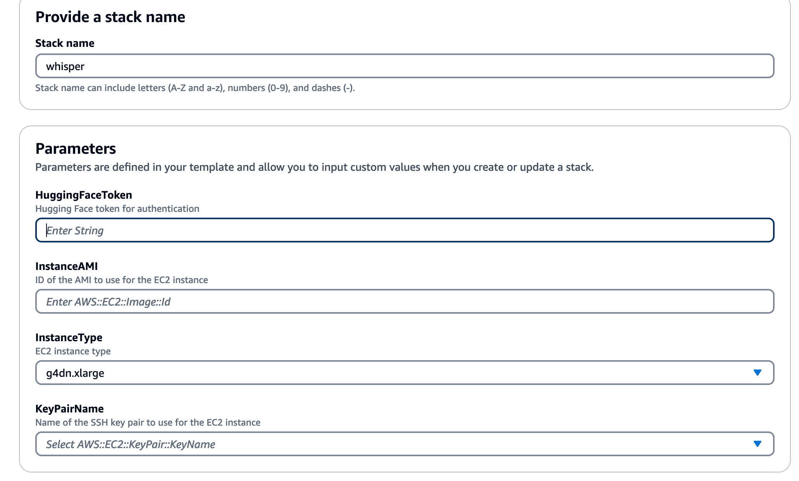
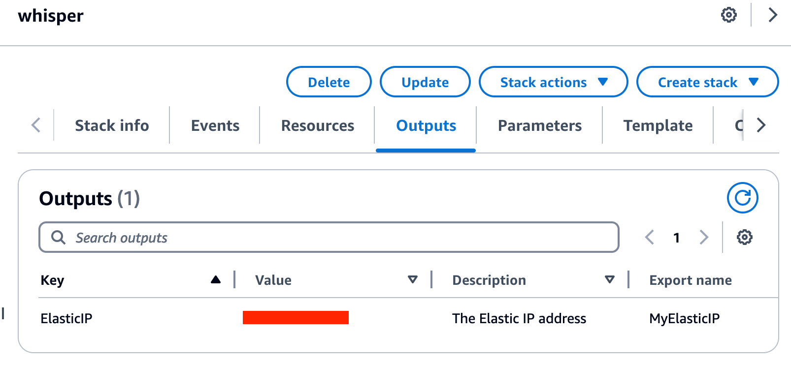
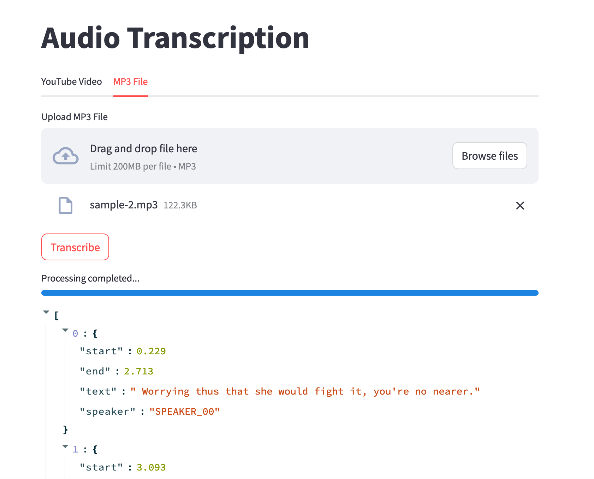

# Whisper on EC2 jumpstart

**Introduction:**

Through Cloudformation on AWS, create a VPC network environment with one click, and deploy an Whisper model within it to run UI based on Streamlit.

**Project Includes:**

- **ui.py**: A Python application based on Streamlit, providing a simple Web interface to use the whisperx model, converting audio to txt.

- **whisper.yaml**: An AWS Cloudformation YAML file that automatically provides AWS G4 instances and installs Nvidia drivers and whisperx related libraries to run `ui.py`.

**Install guide：**

- Accept the user agreement for the following models (click through the links bellow and accept the terms):

  1.  [Segmentation](https://huggingface.co/pyannote/segmentation)
  1.  [Voice Activity Detection (VAD)](https://huggingface.co/pyannote/voice-activity-detection)
  1.  [Speaker Diarization](https://huggingface.co/pyannote/speaker-diarization-3.1).

- Create life EC2 keypair through AWS Console.

  

- Find the ami id through the console interface:

  

- Create stack in cloudformation console

  

- Set parameter of the project

  

- Output IP address after installation:

  

- Wait around 10 minutes for the EC2 instance to initialize the environment and install the diffusion library.

- Connect to the EC2 instance via SSH and run

```
tail -f /var/log/cloud-init-output.log
```

to check the installation progress.

- Connect to the EC2 instance via SSH and

```
run nvidia-smi
```

You should see the NVIDIA system management interface


- Navigate to the whisper directory. The python3 ui.py service is already running by default. You can stop the service with sudo systemctl stop myapp.service.

- Access the output ip address

```
http://{ip_address}:8501
```

to see the UI.


- Stop the background service with

```
 sudo systemctl stop whisper.service
```

- Start the background service with

```
 sudo systemctl start whisper.service
```

##### UI Guide:

- Auto download and transcribe youtube to text

  

- Upload mp3 and transcribe to text

  
