# Whisper on EC2 Jumpstart

**Introduction:**

Through CloudFormation on AWS, create a VPC network environment with a single click, and deploy a Whisper model within it to run a UI based on Streamlit.

**Project Includes:**

- **ui.py**: A Python application based on Streamlit, providing a simple Web interface to use the Whisper model for converting audio to text.
- **api.py**: A FastAPI application, providing an API to query the result file from the S3 bucket.
- **whisper_sqs_message_processor.py**: A Python consumer application to handle messages from the AWS SQS queue. The event message will be pushed to the SQS queue after files are uploaded to the S3 bucket.
- **whisper-prod.yaml**: An AWS CloudFormation YAML file that automatically install the service.

**Installation Guide:**

- Accept the user agreement for the following models (click through the links below and accept the terms):

  1. [Segmentation](https://huggingface.co/pyannote/segmentation)
  2. [Voice Activity Detection (VAD)](https://huggingface.co/pyannote/voice-activity-detection)
  3. [Speaker Diarization](https://huggingface.co/pyannote/speaker-diarization-3.1)
- Set a Hugging Face access token
  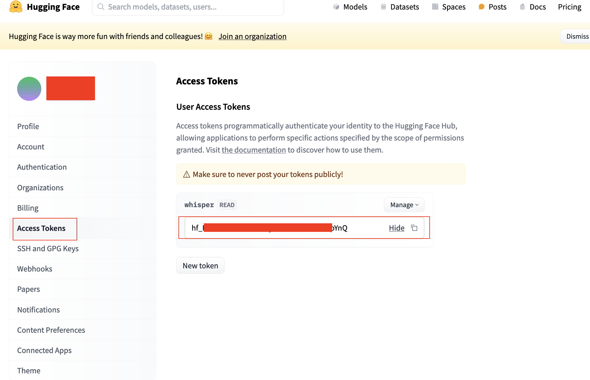

- Create a new EC2 key pair through the AWS Console.

  

- Create a stack in the CloudFormation console.

  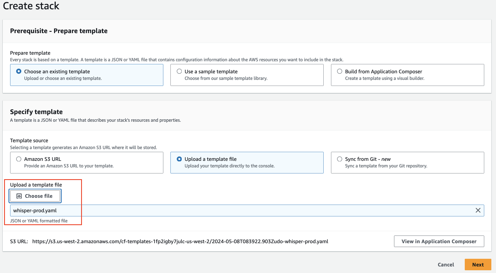

- Set the parameters for the project.

  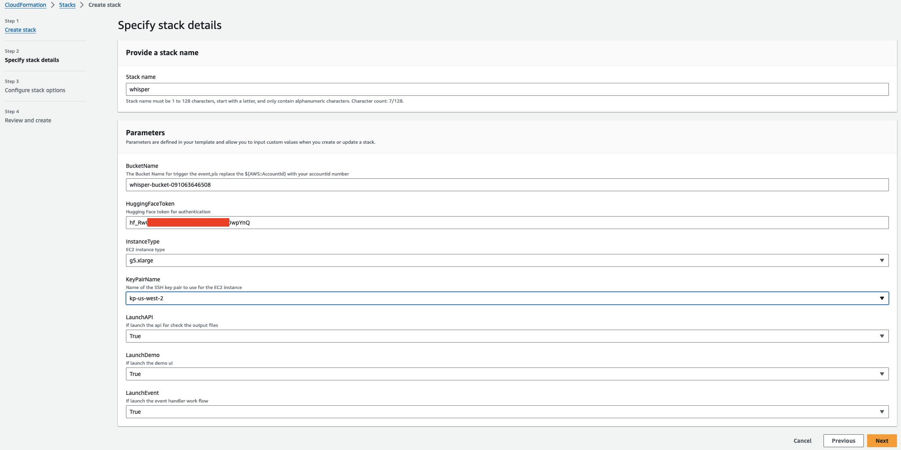

- Note the CloudFront domain name for the UI demo and the Network Load Balancer domain name for the API.

  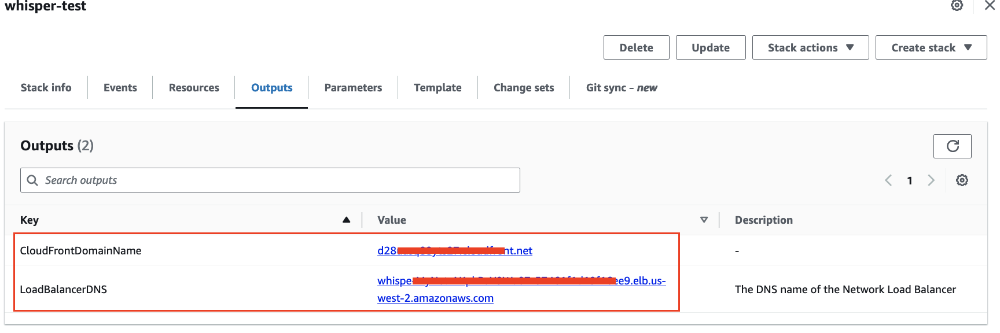

- Wait around 10 minutes for the EC2 instance to initialize the environment.

- Access the CloudFront domain name

```
http://{cloudfrontDomainName}
```

to see the UI.

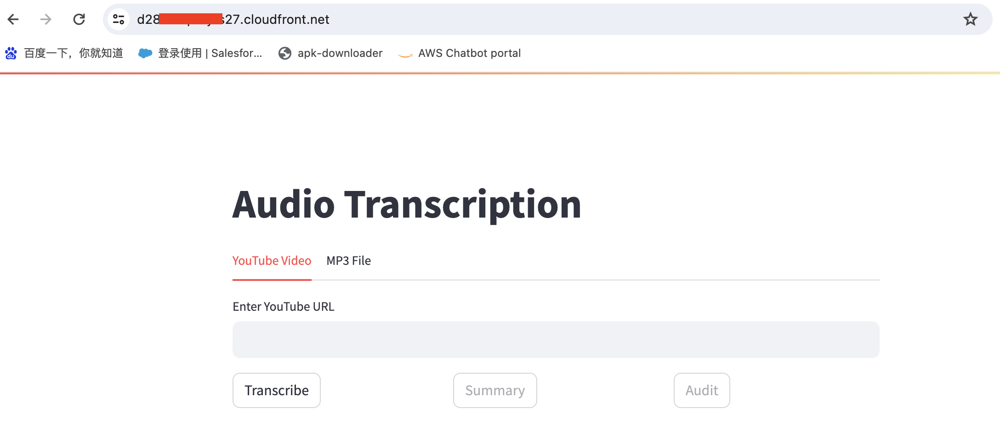

##### UI Guide:

- Auto-download and transcribe YouTube videos to text.

  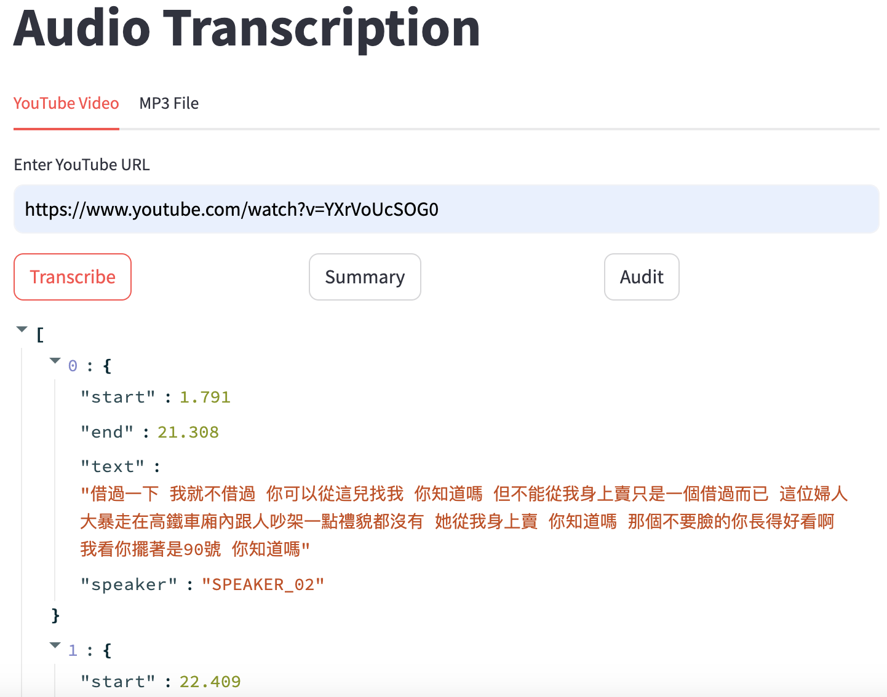

- Summarize the transcription result with Claude3.

  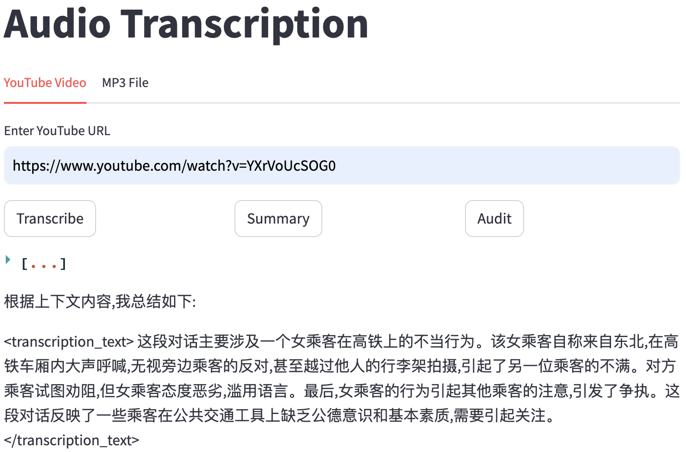

- Audit the transcription result with Claude3.

  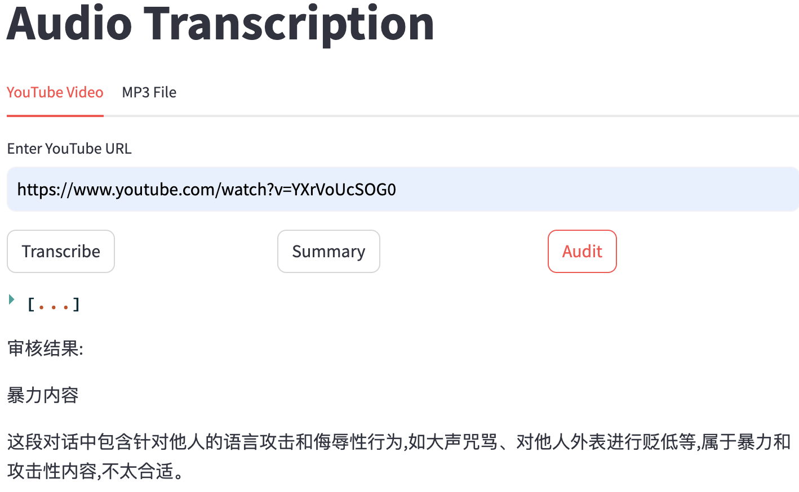

- Upload an MP3 file and transcribe it to text.

  

##### S3 Guide:
- Upload video files to the S3 bucket.
  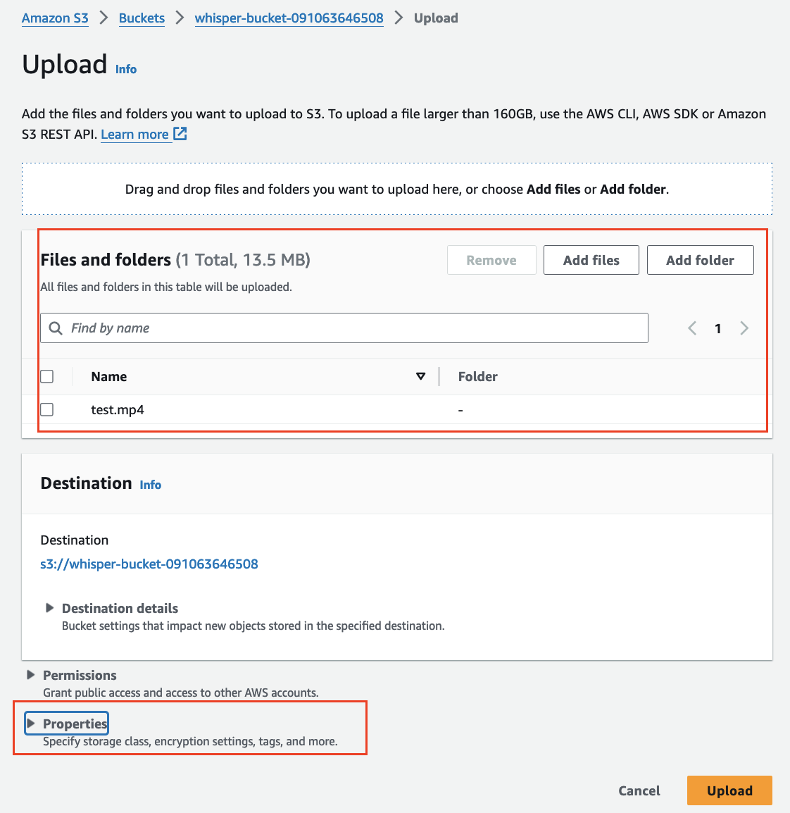

- You can tag the file before uploading it, as shown below.
  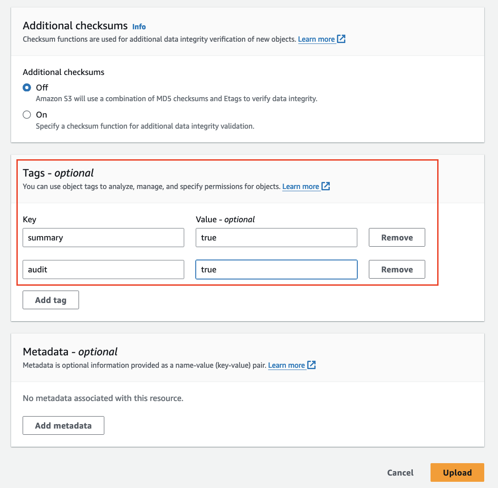

- Wait around 3 minutes, and the transcription file, summary file, and audit file will be automatically uploaded to the bucket.
  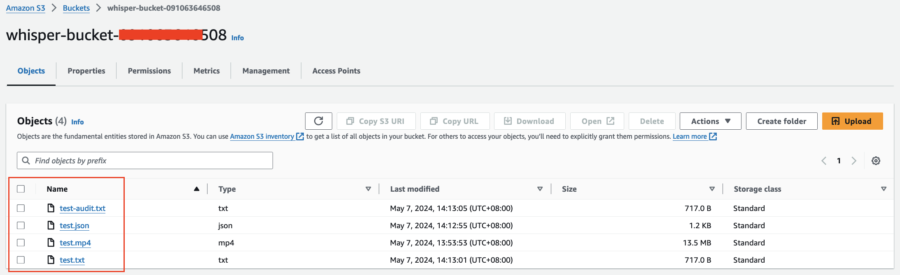

##### API Guide:
- You can use the API to check if the transcription file exists in the bucket.
  
  ```
  curl http://whispe-xxxx.elb.us-west-2.amazonaws.com:9000/check_files?file_path=s3://whisper-bucket-xxx/test.mp4
  ```
